今年もこの時期がやってきました 🎤

iOS関連技術をコアのテーマとした技術者のためのカンファレンスである「iOSDC Japan 2025」の採択結果が公開されました。この記事では各発表枠毎の投稿数・採択数（率）を可視化することで傾向などを探ります。

:::message
mermaid のベータ機能である xychart でグラフを作成しています。
設定上は年ごとの本数表示を行うようにしていますが、なぜか表示されていないです。
:::

## iOSDC Japan 2025 概要
日程：2025年9月19日(Fri)〜21日(Sun)
会場：🆕 有明セントラルタワーホール&カンファレンス
配信：ニコニコ生放送
チケット料金：
　ノベルティ付き一般（オンラインのみ）：2,750円
　ノベルティ付き一般（オフライン + オンライン）：8,800円
　サポーター：16,500円
　U-23：2,750円
公式サイト： https://iosdc.jp/2025/

今年は例年の早稲田大学から場所を移し、有明セントラルタワーホール&カンファレンスにて実施されます。Kaigi on Rails 2024 でも利用された施設ですね。


## トーク（20分 / 40分）
### 20分トーク枠
枠の変更点：特になし

2025年のサマリー
📄 投稿数：213本 / ⬆️増加（6本）
🎤 採択数：34本 / ⬇️減少（1本）
📊 採択率：16.0% / ⬇️降下（-0.9%）

直近3年の投稿数平均：205.7本
直近3年の採択数平均：37.3本

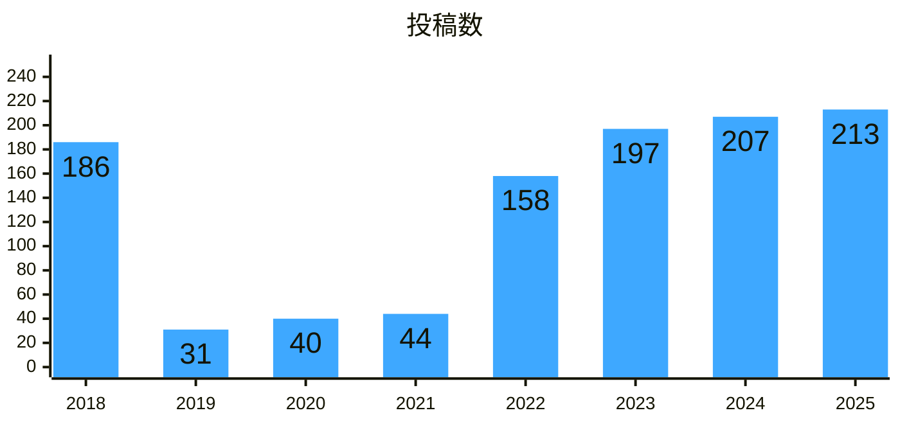

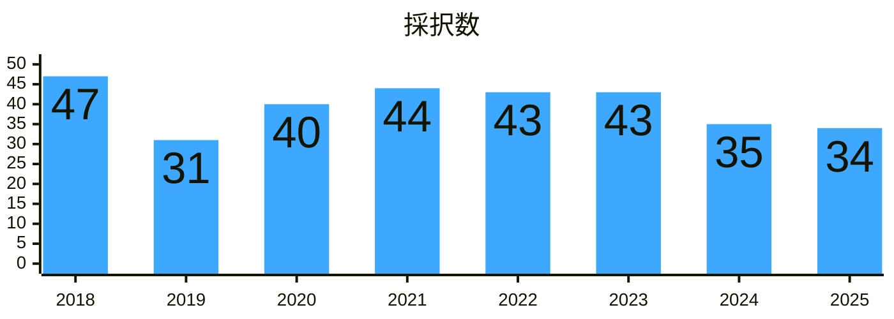

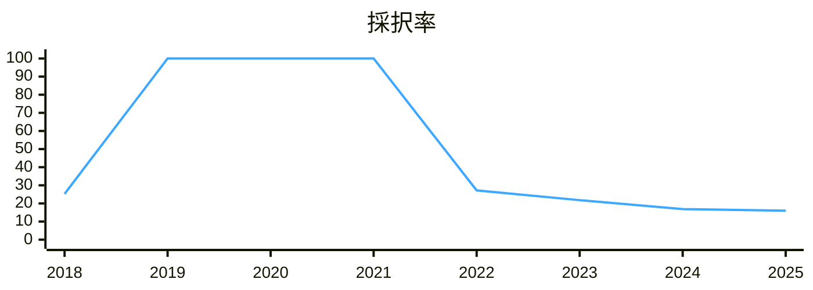

補足[^talk20m]


### 40分トーク枠
枠の変更点：特になし

2025年のサマリー
📄 投稿数：44本 / ⬇️減少（8本）
🎤 採択数：12本 / ➡️昨年同様
📊 採択率：27.2% / ⬆️上昇（4.1%）

直近3年の投稿数平均：48.3本
直近3年の採択数平均：11本

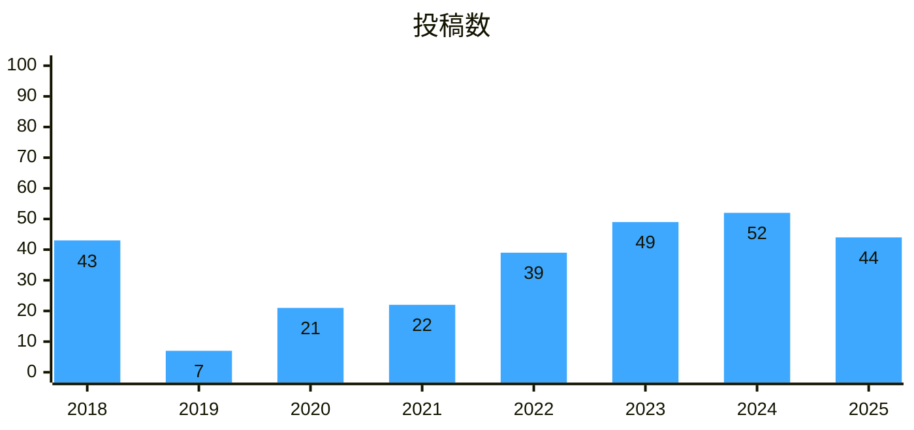

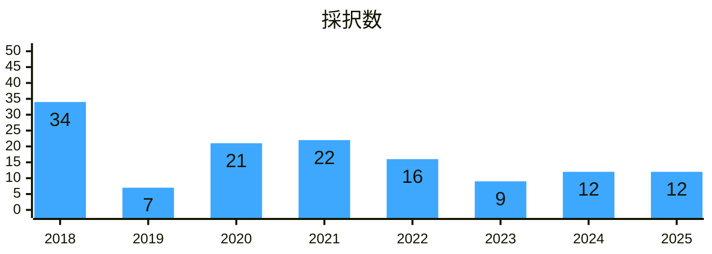

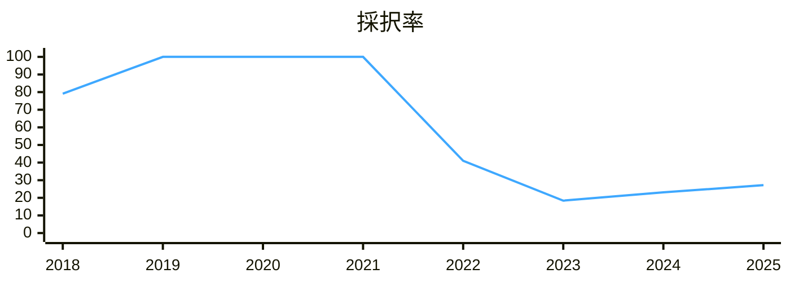

補足[^talk40m]


## LT（ノーマルLT / ルーキーズLT）
### ノーマルLT枠
枠の変更点：特になし

2025年のサマリー
📄 投稿数：83本 / ⬇️減少（5本）
🎤 採択数：16本 / ⬆️増加（2本）
📊 採択率：19.2% / ⬆️上昇（3.3%）

直近3年の投稿数平均：80.7本
直近3年の採択数平均：15.0本

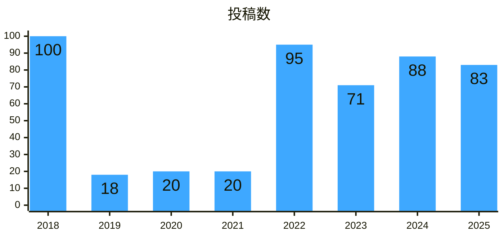

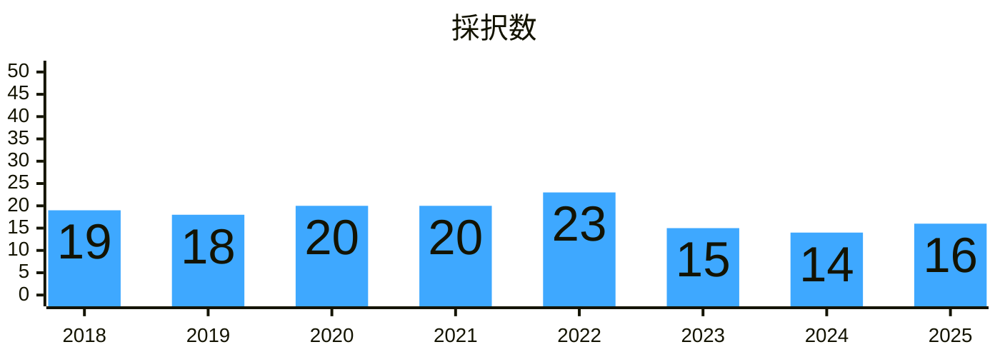


### ルーキーズLT枠
枠の変更点：特になし

2025年のサマリー
📄 投稿数：103本 / ⬇️減少（24本）
🎤 採択数：14本 / ⬇️減少（2本）
📊 採択率：13.5% / ⬆️上昇（2.5%）

直近3年の投稿数平均：103.7本
直近3年の採択数平均：14.7本

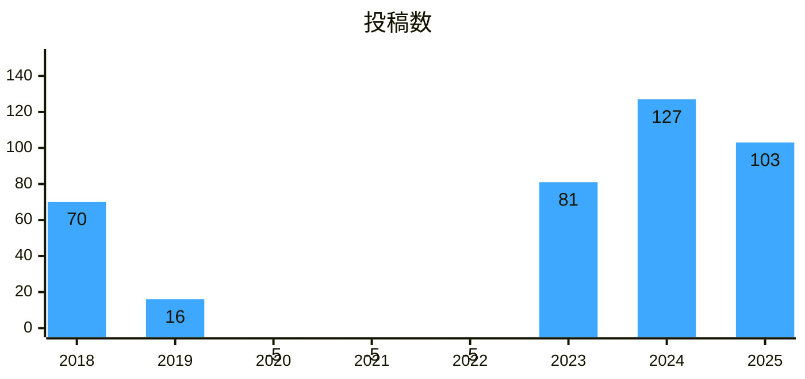

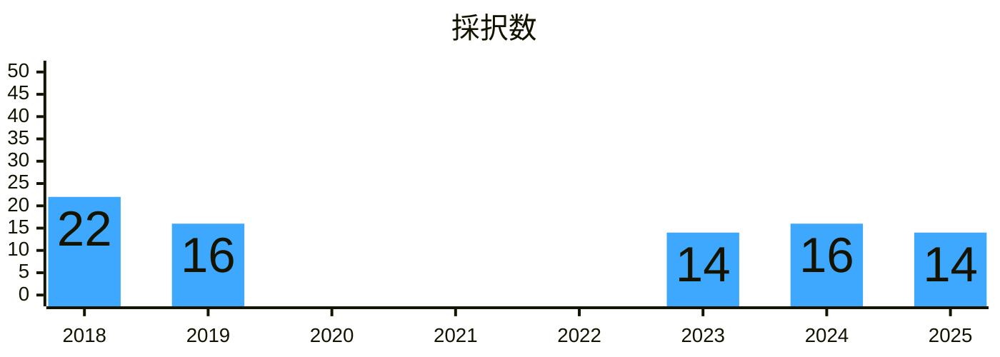

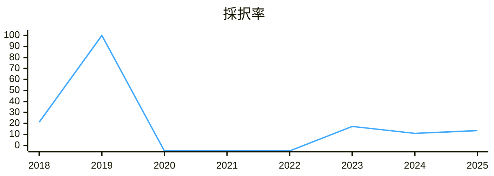

補足[^rookieLT]


## パンフレット（2p / 4p / 8p）
### 2pパンフレット枠
枠の変更点：特になし

2025年のサマリー
📄 投稿数：8本 / ⬆️増加（6本）
🎤 採択数：3本 / ⬆️増加（1本）
📊 採択率：37.5% / ⚠️⬇️急降下（-62.5%）

直近3年の投稿数平均：4本
直近3年の投稿数平均：2.3本

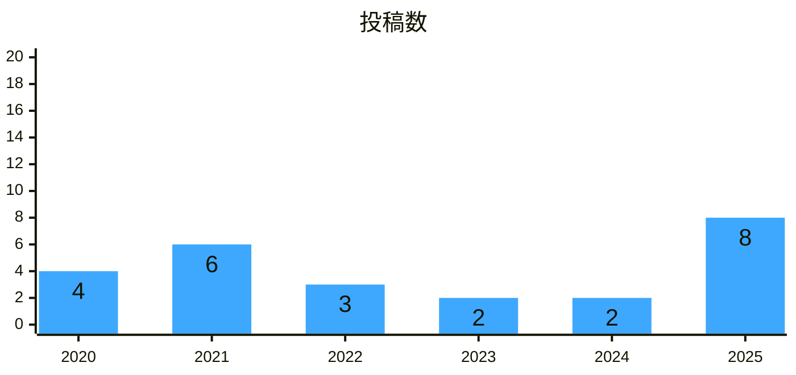

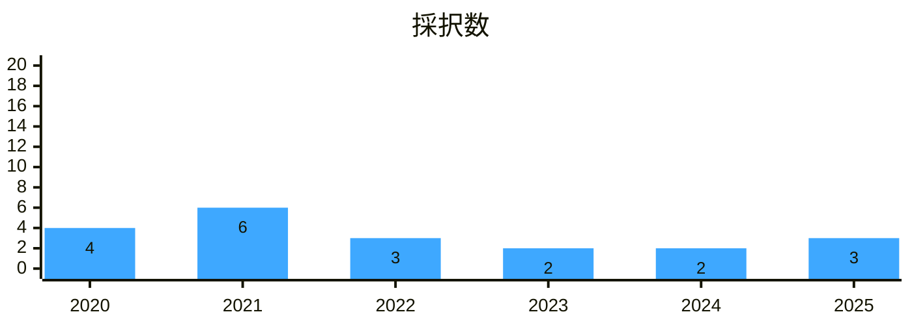

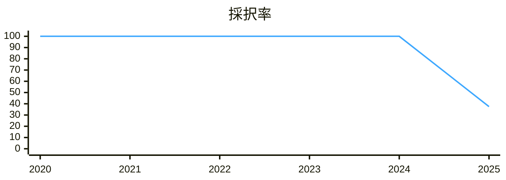

補足[^brochure2p]


### 4pパンフレット枠
枠の変更点：特になし

2025年のサマリー
📄 投稿数：18本 / ⬆️増加（4本）
🎤 採択数：15本 / ⬆️増加（1本）
📊 採択率：83.3% / ⬇️降下（-16.7%）

直近3年の投稿数平均：14本
直近3年の採択数平均：13本

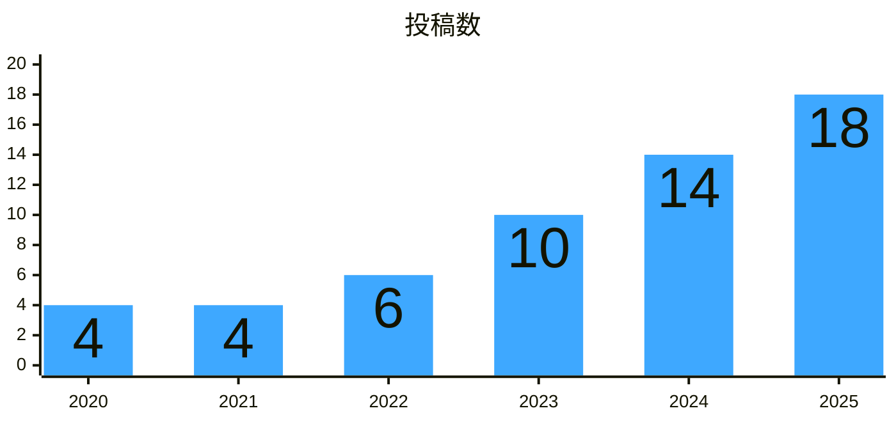

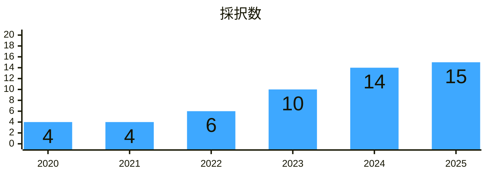

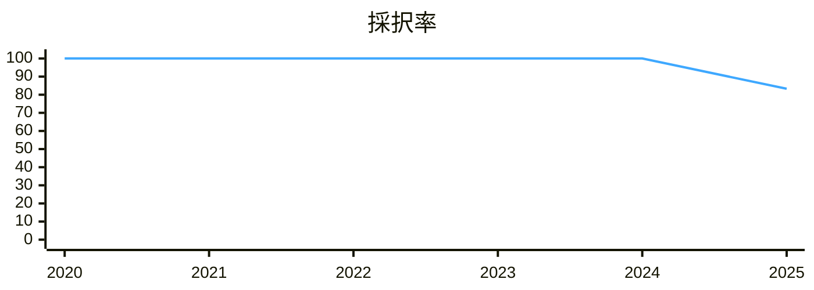

補足[^brochure4p]


### 8pパンフレット枠
枠の変更点：特になし

2025年のサマリー
📄 投稿数：11本 / ⬆️増加（4本）
🎤 採択数：9本 / ⬆️増加（2本）
📊 採択率：81.8% / ⬇️降下（-18.2%）

直近3年の投稿数平均：7.3本
直近3年の採択数平均：6.7本

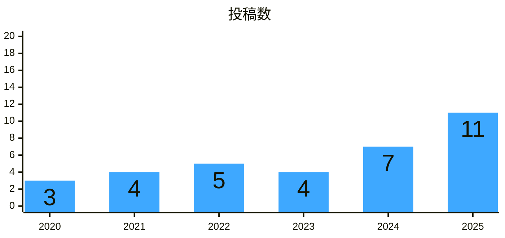

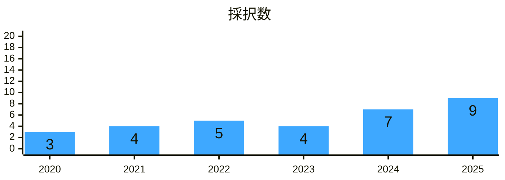

```mermaid
---
config:
    xyChart:
        height: 250
    themeVariables:
        xyChart:
            plotColorPalette: '#3EA8FF'
---
xychart-beta
    title "採択率"
    x-axis [2020, 2021, 2022, 2023, 2024, 2025]
    y-axis 0 --> 100
    line [100, 100, 100, 100, 100, 81.8]
```

補足[^brochure8p]


## まとめ
今年は、これまで採択率100％だったパンフレット枠が投稿本数増加により採択率が軒並み降下しました。特に2p枠は62.5%急降下するなど多くのプロポーザルが採用されませんでした。トーク・LTの本数に関しては20分枠以外はプロポーザル本数が若干減少しており、採択率が上昇しています。

自分も4本投稿しましたが採択されませんでした 😢 来年ことは圧倒的な強みを持って確実に登壇していきたいところです！


[^talk20m]: 2018年はトーク（15分）枠、2019年はトーク（30分）枠の集計となります。
[^talk40m]: 2018年はトーク（30分）枠、2019年はトーク（60分）枠の集計となります。
[^rookieLT]: 2020・2021・2022年はルーキーズLT枠が存在しません。
[^brochure2p]: 2018・2019年は枠が存在しません。
[^brochure4p]: 2018・2019年は枠が存在しません。
[^brochure8p]: 2018・2019年は枠が存在しません。
